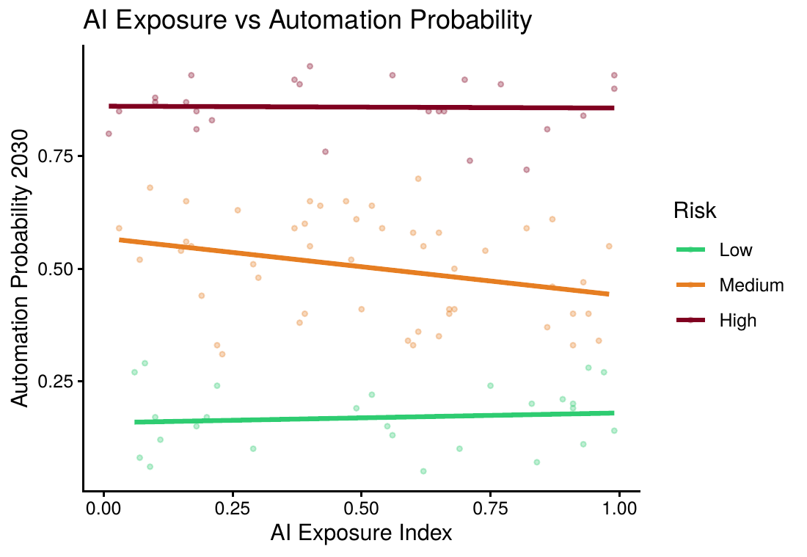

# AI Impact on Jobs 2030: Statistical Analysis in R

A semester-long data analytics project examining salary, automation risk, and AI exposure across 100 job roles. The analysis covers descriptive statistics, correlation analysis, hypothesis testing, and simple linear regression, all done in R.

**Course:** STAT 206, Introduction to Data Analytics | Forman Christian College (A Chartered University), Spring 2026
**Instructor:** Dr. Shakila Bashir

## Overview

This project explores a real-world dataset on how artificial intelligence is projected to affect different job roles by 2030, specifically looking at salary levels, years of experience, education, AI exposure, and automation risk. The goal was to apply a full introductory statistics pipeline end-to-end: explore the data, describe it, test relationships formally, and build a predictive model. The results are reported honestly, including where the data does not support a strong conclusion.

**Objectives:**
- Explore the distribution of salary, AI exposure, and automation risk
- Compare salaries across experience and education groups
- Test correlations between numeric variables
- Build a simple linear regression model to predict salary from experience

## Dataset

Source: [AI Impact on Jobs 2030](https://www.kaggle.com/datasets/khushikyad001/ai-impact-on-jobs-2030) by Yadav, K. (2024), via Kaggle.

The full dataset contains 3,000 observations and 18 variables. This project uses the first 100 observations and 7 selected variables: `Job_Title`, `Average_Salary`, `Years_Experience`, `Education_Level`, `AI_Exposure_Index`, `Automation_Probability_2030`, and `Risk_Category`.

The raw CSV is not included in this repo since it belongs to the original Kaggle uploader. Download it from the link above and place it in the same directory as the `.Rmd` file to reproduce the analysis.

To reproduce the exact scope used in this analysis, slice the first 100 rows in R after downloading the raw dataset:

```r
raw_data <- read.csv("AI_Impact_on_Jobs_2030.csv")
analysis_data <- head(raw_data, 100)
```

## Methodology

| Stage | Techniques used |
|---|---|
| Data handling | Type conversion, missing value checks, factor releveling (ordinal vs nominal) |
| Descriptive statistics | Mean, median, SD, variance, IQR, coefficient of variation, frequency tables |
| Visualization | Histogram, boxplot, scatter plots, bar chart, custom multi-group ggplot2 chart |
| Correlation | Pearson, Spearman, Kendall, with significance testing (`cor.test`) |
| Hypothesis testing | Welch two-sample t-test, one-way ANOVA (F-test), Chi-square test of independence |
| Regression | Simple linear regression with diagnostic plots and confidence-interval predictions |

A few of the test choices were deliberate rather than default: a Welch two-sample t-test was used instead of Student's, since equal variance between the experience groups wasn't assumed going in. Spearman and Kendall correlations were run alongside Pearson specifically to check whether the weak linear correlations might be hiding a monotonic but non-linear relationship (they weren't; all three methods agreed).

## Key Findings

The honest headline finding of this project is a null result, and it's reported as is rather than reframed to look stronger than it was.

- **No variable tested had a statistically significant relationship with salary.** Correlations between salary and experience, AI exposure, and automation probability were all weak (|r| < 0.11, p > 0.05).
- **The t-test, ANOVA, and Chi-square tests all failed to reject their null hypotheses.** Salary didn't differ significantly by experience group or education level, and education level was independent of automation risk category.
- **The regression model (Salary ~ Years of Experience) had an R² of 0.0114.** Experience explains about 1% of salary variation, meaning the model has essentially no predictive power on its own.
- Automation risk category did track logically with AI Exposure Index and Automation Probability, as expected. This confirms the risk labels in the dataset are internally consistent, even though they don't relate cleanly to salary.

**Practical takeaway:** in this dataset, salary appears to be driven by factors outside experience, education, and AI exposure alone, likely job specific or industry specific factors that weren't captured here. That's a real and useful conclusion, not a shortcoming of the analysis. Given how little of the variation a single predictor explains, the natural next step is a multiple regression that brings in variables like industry, role seniority, or location, rather than continuing to test simple relationships one at a time.



*Custom multi-group visualization: Risk Category tracks logically with both AI Exposure Index and Automation Probability, even though neither relates significantly to salary.*

## Repository Structure

```
├── ai_jobs_2030_analysis.Rmd   # Full R Markdown source (code + narrative)
├── ai_jobs_2030_analysis.pdf   # Knitted PDF report
├── images/
│   └── ai_exposure_vs_automation_by_risk.png   # Key chart, embedded in README
├── docs/
│   └── presentation.pdf        # Class presentation slides (exported from PowerPoint)
└── README.md
```

See the full [R Markdown source](ai_jobs_2030_analysis.Rmd), the [knitted PDF report](ai_jobs_2030_analysis.pdf), or the [presentation slides](docs/presentation.pdf).

## Tools

R, ggplot2, base R statistical functions (`t.test`, `aov`, `chisq.test`, `lm`, `cor.test`), knitr and pdflatex for report generation.

## Limitations

- Cross-sectional snapshot; no time-series data to observe actual change toward 2030
- Automation probabilities are dataset-provided estimates, not observed outcomes
- Key variables likely driving salary (industry, specific role seniority, location) aren't in the selected feature set
- With n = 100 split across 4 education levels and 3 risk categories, some subgroup cell sizes (e.g. Bachelor's at 17 observations) are small enough to limit the statistical power of the ANOVA and Chi-square tests to detect a real effect, even a moderate one
- Only the first 100 of 3,000 available rows were used, per assignment scope

## License

This project is licensed under the [MIT License](LICENSE). The dataset itself remains the property of its original Kaggle uploader; see the Dataset section above for attribution.

## Author

**Muhammad Haseeb Ul Hassan**  
BSCS, Data Analytics & Mathematics Minors | Forman Christian College (A Chartered University)  
[LinkedIn](https://www.linkedin.com/in/muhammad-haseeb-ul-hassan) · [GitHub](https://github.com/m-haseeb-ul-hassan)
